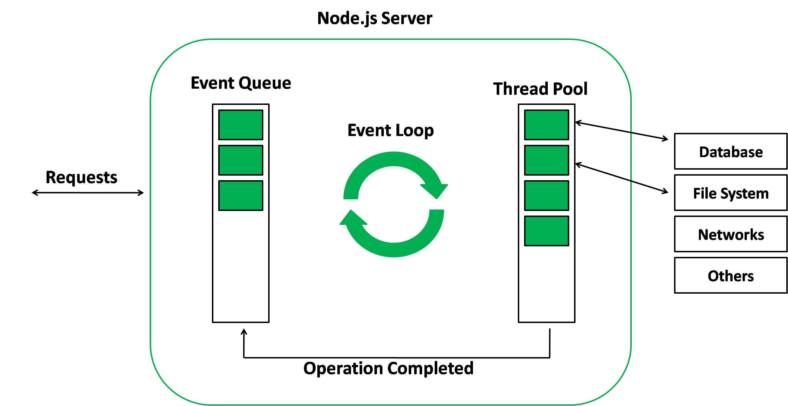

# Request & Response

### Node Lifecycle and Event Loop

### How to exit event loop

### Understand request object

### Sending Response

### Routing Request

### Tasking User Input

### Redirecting request

**Node Lifecycle and Event Loop**


**How to exit event loop**

```
// Simple Node js server
const http = require("http");

const server = http.createServer((req, res) => {
  console.log(req);
  process.exit(); // Stop event loop after first request
});

const PORT = 3000;
server.listen(PORT, () => {
  console.log(`Server is running on port http://localhost:${PORT}`);
});

```

**Understand request object & Sending Response**

```
const http = require("http");

const server = http.createServer((req, res) => {
  console.log(req.url, req.method, req.headers);
  // process.exit(); // Stop event loop after first request
  res.setHeader("Content-Type", "text/html");
  res.write("<html>");
  res.write("<head><title>My First Page</title></head>");
  res.write("<body><h1>Hello from Node.js Server!</h1></body>");
  res.write("</html>");
  res.end();
});
```

**Routing Request**

```
if (req.url === "/") {
    res.setHeader("Content-Type", "text/html");
    res.write("<html>");
    res.write("<head><title>My First Page</title></head>");
    res.write("<body><h1>Wellcome to Node.js Server</h1></body>");
    res.write("</html>");
    return res.end();
  } else if (req.url === "/about") {
    res.setHeader("Content-Type", "text/html");
    res.write("<html>");
    res.write("<head><title>My First Page</title></head>");
    res.write("<body><h1>About Page</h1></body>");
    res.write("</html>");
    return res.end();
  }
```

**Taking Input And Redirect Request**

```
const http = require("http");
const fs = require("fs");

const server = http.createServer((req, res) => {
  console.log(req.url, req.method, req.headers);
  // process.exit(); // Stop event loop after first request
  if (req.url === "/") {
    res.setHeader("Content-Type", "text/html");
    res.write("<html>");
    res.write("<head><title>My First Page</title></head>");
    res.write("<body><h1>Enter Your Details</h1>");
    res.write("<form action='/submit' method='post'>");
    res.write("<label for='name'>Name:</label>");
    res.write("<input type='text' id='name' name='name'><br><br>");
    res.write("<label for='email'>Email:</label>");
    res.write("<input type='email' id='email' name='email'><br><br>");
    res.write("<input type='submit' value='Submit'>");
    res.write("</form>");
    res.write("</body>");
    res.write("</html>");
    return res.end();
  } else if (req.url.toLowerCase() === "/submit" && req.method === "POST") {
    console.log("Form submitted", req.body);
    fs.writeFileSync("data.txt", "Name: Ashaddozzaman");

    // fs.appendFileSync("data.txt", "Email: " + req.body.email);
    res.statusCode = 302;
    res.setHeader("Location", "/");
    return res.end();
  }
  res.setHeader("Content-Type", "text/html");
  res.write("<html>");
  res.write("<head><title>My First Page</title></head>");
  res.write("<body><h1>Hello from Node.js Server!</h1></body>");
  res.write("</html>");
  res.end();
});
```
